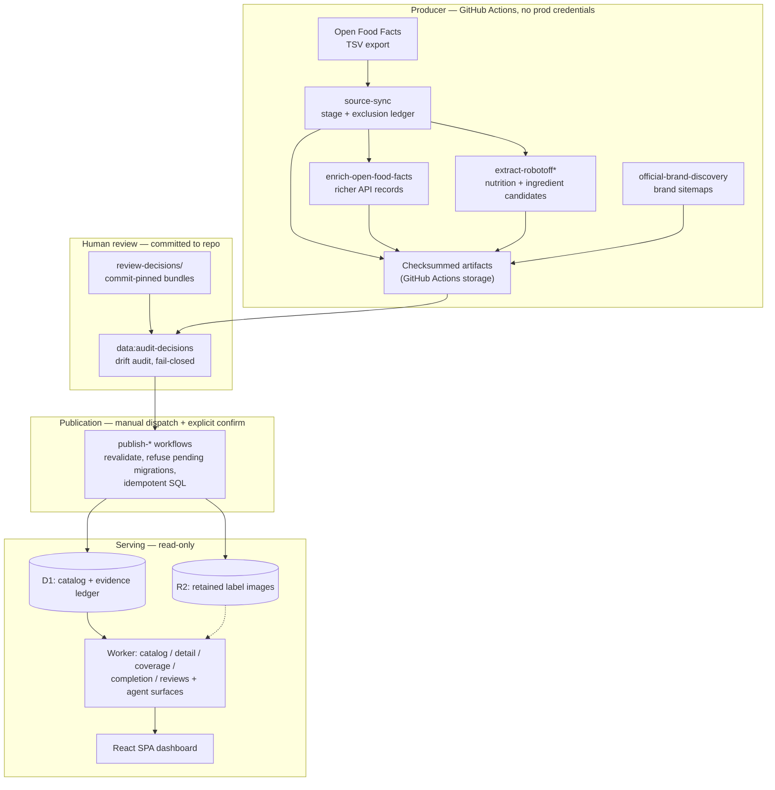

# How Protein Index works, end to end

This is a learning-oriented walkthrough for someone new to the codebase. It
follows one thing — a food product — from a raw Open Food Facts row to a
verified fact rendered on the dashboard, and explains why the system is shaped
the way it is. It does not restate schema, per-workflow, or per-state detail;
those have canonical homes and are linked inline.

If you only read one other page, read the
[architecture overview](overview.md). This page is the narrative that ties the
overview, the [data model](data-model.md), and the
[evidence pipeline](evidence-pipeline.md) into a single story.

## What it actually is

Protein Index is not a scraper and not a nutrition calculator. It is an
**evidence ledger** for Indian food products, with a thin read-only web app on
top. The whole design exists to answer one question honestly for each product:
*do we actually know this, and how?*

The web stack is deliberately boring — a Vite + React SPA
([`src/App.tsx`](../../src/App.tsx)) served by a single Cloudflare Worker
([`worker/index.ts`](../../worker/index.ts)), backed by one D1 database and one
private R2 bucket. All the interesting engineering is in the rule that governs
what may cross from *observed* to *verified*. See the
[product overview](../product/overview.md) for scope and the
[evidence policy](../product/evidence-policy.md) for the four evidence states.

The organizing invariant: **the product record is canonical; retailer and
source listings are observations attached to it, never identity by
themselves.** A product is keyed by GTIN. Everything else — a retailer offer, a
label image, a model's transcription — is evidence pointing at that product,
and each piece of evidence carries its own trust state.

## The three worlds

The codebase splits cleanly into three environments that never share write
access. This is the single most important thing to internalize.

1. **Producer** ([`scripts/`](../../scripts/) run by
   [`.github/workflows/`](../../.github/workflows/)) has *no* production
   credentials. It downloads sources, runs adapters, and uploads checksummed
   artifacts. It never writes to D1. A green producer run does **not** trigger
   publication.
2. **Publication** is always a *separately dispatched* workflow (the
   `publish-*` files) that revalidates the artifact, checks source/cohort
   accounting, refuses pending migrations, and emits idempotent SQL. The
   `production` GitHub environment scopes credentials as defense in depth; the
   real gate is explicit human dispatch.
3. **Serving** ([`worker/`](../../worker/)) is read-only. The Worker denies
   mutations in production — corrections are republished as new
   evidence-preserving runs, never by editing the ledger.

Why this separation exists: it makes it structurally impossible for a source
download or a model's guess to silently become a fact. Full rationale in the
[decision log](decisions/README.md).

## The journey of one product

Follow a single India-tagged food row through the machine. Each numbered stage
is a fail-closed gate — it either produces a checksummed, auditable artifact or
stops the run. The canonical per-stage detail lives in the
[evidence pipeline](evidence-pipeline.md); this is the connective tissue.

### 1. It gets staged, not trusted

`source-sync` (weekly cron) streams the *entire* official Open Food Facts TSV
export to end-of-file — no search-API cherry-picking — and reconciles every
India-tagged row to either a staged product or an exclusion-ledger entry with a
reason code. The command is
[`scripts/sync.ts stage`](../../scripts/sync.ts) via the
[open-food-facts adapter](../../scripts/adapters/open-food-facts.ts).

The design decision here: **ingest broadly first, classify protein later.**
Deciding "is this a protein product?" is a downstream classification
([`shared/classification.ts`](../../shared/classification.ts)), not an
ingestion filter, so the exclusion ledger stays auditable and reclassification
never re-fetches.

At this point the row is `unverified`. Open Food Facts values are never
promoted to facts just because they parsed.

### 2. It gets enriched and its label gets read — still not trusted

Two independent producer lanes run against the *exact* barcode set from a
successful source-sync:

- **Enrichment** ([`enrich`](../../scripts/adapters/open-food-facts-api.ts))
  pulls richer per-product API records.
- **Extraction** ([`extract-robotoff`](../../scripts/adapters/robotoff.ts) and
  [robotoff-ingredients](../../scripts/adapters/robotoff-ingredients.ts)) reads
  nutrition and ingredient *candidates* off label images.

Both emit checksummed artifacts and write nothing to D1. Model output is a
**review-only candidate** — extraction confidence, however high, never
increases verified coverage. A separate brand lane
([`discover-official-brand.ts`](../../scripts/discover-official-brand.ts))
crawls brand sitemaps for identity evidence.

A subtle but load-bearing rule lives here: **mass and volume are never
collapsed.** A `per_100g` label and a `per_100ml` label stay dimensionally
separate; there is no millilitre-to-gram conversion without density evidence
(see [`shared/nutrition.ts`](../../shared/nutrition.ts) and the invariant in the
[data model](data-model.md)). Unitless sodium is rejected, not assumed grams.

### 3. A human reviews it

An operator compares the current label image against the exact normalized
candidate. Verification applies *that exact candidate* with its provenance;
rejection isolates it. Decisions are bundled into commit-pinned, checksummed
bundles under [`review-decisions/`](../../review-decisions/) — the active set is
`review-decisions/active-bundles.json`. Historical bundles stay immutable on
disk for audit history. Still no D1 write.

There is also an **offline automated label lane** (`machine-label*` scripts,
e.g. [`machine-label-run.ts`](../../scripts/machine-label-run.ts)) that
produces a distinct `machine_verified` nutrition state. It is deliberately its
own state so it can never masquerade as human or brand verification — see the
fifth state in the [evidence policy](../product/evidence-policy.md).

### 4. Drift is audited before anything ships

`pnpm data:audit-decisions`
([`scripts/audit-decisions.ts`](../../scripts/audit-decisions.ts)) checks the
checked-in decision set against one exact, checksum-validated artifact. It is
read-only, CI-safe, and fails closed on conflicting decision identities or
inconsistent proof. A legacy decision that merely *looks like* fresh evidence
is never upgraded in place — immutable extraction linkage requires a newly
reviewed decision.

### 5. It is published — idempotently, on purpose

A manually dispatched `publish-*` workflow revalidates everything (source/cohort
accounting, checksums, immutable run identity, authority boundary), refuses
pending migrations, and writes idempotent SQL to D1. Replaying the same
artifact is a no-op. The fresh-evidence path is *structurally incapable* of
increasing verified counts or overwriting verified rows — those require the
reviewed path. Migration application rules live in the
[data model](data-model.md).

### 6. It is served

The Worker exposes the ledger read-only. The SPA
([`src/App.tsx`](../../src/App.tsx)) calls `/api/products`,
`/api/products/:id`, `/api/coverage`, `/api/completion-ledger`, and
`/api/reviews` through [`src/api.ts`](../../src/api.ts). Deterministic metrics
(protein per 100 kcal, cost per 25 g protein, etc.) are computed in
[`shared/metrics.ts`](../../shared/metrics.ts) — and any metric returns
`{ value: null, reason }` rather than a fabricated number when inputs are
missing or dimensionally invalid. Missing values stay missing.

## The two boundaries the dashboard draws

Everything above exists to let the UI honestly split products into two zones
(defined canonically in the [evidence policy](../product/evidence-policy.md)):

- **Trusted** — shown only when *all three* agree: exact current identity,
  authority-100 verified nutrition, and terminal ingredient evidence.
  Contradictions fail closed and drop out of Trusted.
- **Discovery** — comparison metrics appear when structured nutrition passes
  validation; community evidence stays visibly unverified; missing or
  conflicting values are withheld rather than guessed.

The strict Trusted gate is enforced in SQL (migrations 0015–0019, see the
[data model](data-model.md)) and read back by the Worker's catalog, completion,
and coverage endpoints — not computed ad hoc in the UI.

## Agent-readable surfaces

Because agents should not be handed fake HTML 200s, the Worker serves
machine-readable surfaces *before* the SPA asset fallback: `/llms.txt`,
`/index.md`, `/api/ai`, `/api/products/:id.md`, and `/sitemap.xml`
([`worker/agent-index.ts`](../../worker/agent-index.ts)). `wrangler.jsonc`
lists these under `assets.run_worker_first`. Details in the
[architecture overview](overview.md).

## Where to go next

- [Architecture overview](overview.md) — topology, code map, resource bindings.
- [Data model](data-model.md) — the D1 schema and migration narrative.
- [Evidence pipeline](evidence-pipeline.md) — per-stage gate detail and
  cache/replay rules.
- [Evidence policy](../product/evidence-policy.md) — the four (plus one) states
  and promotion/revocation rules.
- [Decision log](decisions/README.md) — the ADRs behind these boundaries.
- [Failed approaches](../knowledge/failed-approaches.md) — the mistakes that
  produced these gates.
